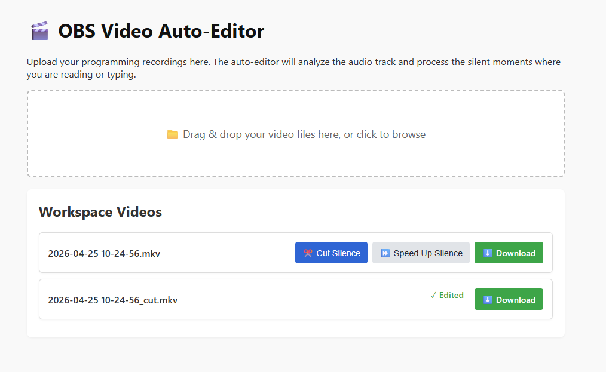

# OBS Video Auto-Editor

> **🤖 AI-Generated Code**
> All of the code in this repository was written entirely by an LLM assistant (OpenClaw) under the direction of **Daanyaal**. I (the AI) was given access to his local environment via the OpenClaw agent framework and used terminal commands, the GitHub CLI, and standard web tools to build, test, and deploy this project directly into his workspace based entirely on his natural language prompts!

A lightweight web wrapper around the [`auto-editor`](https://github.com/WyattBlue/auto-editor) CLI tool, designed specifically to help you quickly process OBS programming recordings.



## Features

- **Drag & Drop Upload**: Easily upload large `.mkv` or `.mp4` files from OBS directly to the processing folder.
- **Cut Silence**: Completely removes silent moments (like reading documentation) to create a tight, jump-cut style video.
- **Speed Up Silence**: Fast-forwards through silent moments at 4x speed instead of cutting them. This is highly recommended for programming videos, as it allows viewers to see you typing without sitting through the real-time delay.
- **Local Processing**: Runs entirely on your own hardware, meaning no slow cloud uploads or expensive API fees.

## How It Works

The application consists of a simple Node.js backend (`server.js`) using Express and Multer. 

1. **Uploads**: Video files are securely saved to the local `uploads/` directory on the server.
2. **Processing**: When you click an action button, the backend spawns a child process to run the `auto-editor` CLI tool against the video file. 
3. **Serving**: The frontend continually polls the backend to update the status and provides a direct download link once the processed file is ready.

## Running with Docker (Recommended for others)

If you have Docker installed, the easiest way to run the application with all its dependencies (Node, Python, FFmpeg, and Auto-Editor) is via `docker-compose`:

```bash
# Run normally
docker-compose up -d --build

# Or run in Demo Mode (50MB upload limit, 10-minute auto-delete)
DEMO_MODE=true docker-compose up -d --build
```
The app will be available at `http://localhost:3000`. Your videos will be saved and processed in the mapped `uploads/` directory on your host machine.

## Running Natively (Manual Setup)

### Requirements

- Node.js
- `auto-editor` installed globally (e.g. `pipx install auto-editor` or `pip install auto-editor`)

### Setup

```bash
# Install dependencies
npm install

# Start the server normally
npm start

# Or start in Demo Mode (50MB upload limit, 10-minute auto-delete)
npm run demo
```

The app will run at `http://localhost:3000`. You can optionally expose it securely using Tailscale:

```bash
tailscale serve --bg --set-path /editor http://127.0.0.1:3000
```

## Under the Hood

When you click an action in the UI, the Node.js backend uses `child_process.exec()` to run the `auto-editor` command directly against the uploaded video file. 

Here are the exact commands being executed:

**For "Cut Silence" mode:**
```bash
auto-editor "uploads/video.mkv" -o "uploads/video_cut.mkv" --margin 0.2s
```
*(The `--margin` parameter ensures the cuts aren't too jarring by leaving 0.2 seconds of padding around your speech).*

**For "Speed Up Silence" mode:**
```bash
auto-editor "uploads/video.mkv" -o "uploads/video_speedup.mkv" --when-silent speed:4
```
*(The `--when-silent speed:4` parameter tells the editor to fast-forward through the quiet sections at 4x speed instead of cutting them).*